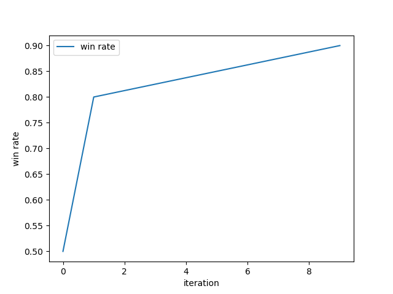
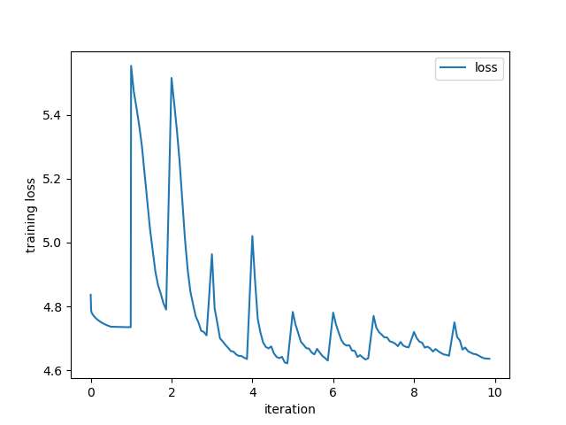

# Artificial Intelligence applied to Go

For this project, two players have been implemented:
- An Alpha-Beta based agent using a naive heuristic with iterative deepening
- A Monte Carlo Tree Search based agent using AlphaZero methods

99% of the time spent on this project was spent on the AlphaZero agent (and this is the only thing worth mentioning, the other implementation being trivial). However, because training time is very long on usual hardware, the agent can't be used for the Tournament. Despite this, it is worth mentioning that the agent is able to beat the random player 100% of the time, which was the goal that we had in mind. 

Below is a brief description of the methods used for each agent.

## Alpha-Beta - Tree Search

Simple tree search algorithm that uses alpha-beta pruning to find the best move, with an heuristic based on the score of the board, using iterative deepening and move ordering.

### Source files

* `NaiveAlphaBeta.go`: Naive implementation of the Alpha-Beta algorithm

### Implementation details

#### Heuristic

During the early game (less than 20 moves), positional features, liberties and difference between scores are used to evaluate the board.
During the remaining of the game, the heuristic used is the most basic one, which is based on the difference between scores, from the perspective of the agent.

#### Openings

Because it doesn't make any sense to waste time on an alpha-beta search of depth 1 during the early game, moves are taken - if they exist - from the samples provided, else, an AlphaBeta search of depth 0 is performed, since GNU Go's moves are obviously better crafted.

Fuseki's opening could have been used, but I'm not playing for the sake of the tournament.

#### Iterative deepening

To respect the time limit, the search is iterated until the time limit (7 seconds) is reached. If the time limit is reached, the search is stopped and the best move from the previous depth is returned. It is worth mentioning that we force the search to be at least of depth 1.

Moreover, move ordering is used to speed up the search. This is done by ordering the moves based on the utility evaluations of the previous depth. Hence, cutoffs are more likely to happen, and a deeper search can be performed.

#### Transposition table

In order not to waste time on an evaluated subtree, a transposition table is used. This is a simple hashmap of the board state, with the score of the board as the value.

#### AlphaBeta pruning

To discover the best move, the search is performed in a depth-first manner, with the simple idea of pruning the branches that are not promising. This is done by keeping track of the alpha and beta values, and only exploring the branches that are promising.

### Results

This simple implementation of the Alpha-Beta algorithm was able to beat the random player 100% of the time (as expected).


## AlphaZero - Reinforcement Learning

Simple Reinforcement Learning for the 9x9 Go board game with AlphaZero, based on DeepMind's AlphaGo Zero<sup>**[1]**</sup>.

### Source files

#### AlphaZero implementation

* `Arena.py`: Compare the newly trained model with the best one.
* `MCTS.py`: Monte Carlo Tree Search implementation.
* `NNet.py`: AlphaZero neural network architecture.
* `SelfPlay.py`: Generate neural network input features playing games with currently the best agent to be used in the unsupervised learning process.
* `Train.py`: Reinforcement learning training procedure.
* `Config.py`: Configuration file used to set the hyper-parameters.
* `AlphaZeroPlayer.py`: AlphaZero player implementation to be used for the project tournament.

#### Supervised learning

* `dataset_builder.py`: Generate neural network input features from a dataset for supervised learning.
* `train_alphazero.py`: Train an initial model using the input features resulting from the dataset. 

#### Open-source

* `features.py` & `go.py`: Open-source go board game implementation _as is_ from Brian Lee & Andrew Jackson (https://github.com/tensorflow/minigo).

#### Project-related

The following files are from the project package, from Laurent Simon:

* `Gnugo.py`: Connection with the Go Text Protocol of GNU Go implementation.
* `Goban.py`: Go board game implementation.
* `gnugoPlayer.py`: GNU Go player implementation.
* `playerInterface.py`: Player interface for the leaderboard.
* `randomPlayer.py`: Random player implementation.
* `namedGame.py`: Allows to play a game between two agents using the player interface.

### Requirements

This project requires dependencies according to your willingness to use or GPU or not. To take the most profit out of this project, please consider using a GPU, the latter greatly speeding up the NNet-related features.

#### CPU-only

For a CPU-only use, the following environnement should do the trick.
* Python 3.8
* tensorflow (2.6.0)
* tqdm

#### GPU

_NVIDIA CUDA Toolkit_

Dependencies for an NVIDIA GPU use greatly varies according to your GPU. However, you'll need to have CUDA Toolkit; Please refer to _NVIDIA CUDA Toolkit Documentation_ for installation:
* Windows : https://docs.nvidia.com/cuda/cuda-installation-guide-microsoft-windows/index.html
* Linux : https://docs.nvidia.com/cuda/cuda-installation-guide-linux/index.html

_NVIDIA cuDNN_

Having installed CUDA, the next step is to download and install _cuDNN_. Downloading can be made at the following link:
* https://developer.nvidia.com/cudnn

Unzip cuDNN files and copy them to their respective CUDA folders.

At this point, you should check that the NVIDIA toolkit has been added to your PATH. You may also need to reboot your computer.

_Setting up the python environnement_

Now that CUDA and cuDNN are installed, you should be allset for a proper python environnement installation. A minimalist environnement for this project is:
* Python 3.8
* cudatoolkit (version depends on your GPU)
* cudnn (version depends on your CUDA version)
* tensorflow-gpu (2.6.0)
* tqdm

A sample procedure to create a conda environnement could be (for a GTX 1660 Super/CUDA 11.3):
```shell
conda create --name tf2 python=3.8.0
conda activate tf2
conda search cudatoolkit
conda search cudnn
conda install cudatoolkit=11.3.1 cudnn=8.2.1 -c=conda-forge
pip install --upgrade tensorflow-gpu==2.6.0
conda install -c conda-forge tqdm
pip install keras==2.6
```

Note that `pip install keras==2.6` may or may not be useful, yet, the keras version should correspond to the tensorflow's one.

_Testing the environnement_

You can test your installation with the following python code:
```python
import tensorflow as tf
print(tf.config.list_physical_devices())
```
The GPU should appear in the list.

### Usage

#### Supervised learning

Unsupervised learning can be a long journey on traditional hardware. For this reason, a supervised learning process can be initiated, using GNUGo's scores to set policy's values, and win probability for the value. The process is divided in two stages:

**1.** Generate the dataset.
```shell
python dataset_builder.py
```

**2.** Train the model.
```shell
python train_alphazero.py
```

This procedure will generate an initial model `trained.h5` to start with, located under `model/`.

_Nota Bene_: This process can take a while to complete if using a CPU-only environnement.

#### Unsupervised learning

The unsupervised learning process is the most important one in this project. It is the process of training a neural network to play against itself. The process is divided in three steps:
* Self-play: Generate neural network input features from a dataset.
* Retrain network: Train an initial model using the input features resulting from the dataset.
* Evaluate network: Compare the newly trained model with the best one.

If you want to use the unsupervised learning process, you can run the following command:
```shell
python Train.py
```
Hyper-parameters can be changed in the `Config.py` file. This process should iteratively strengthen the `best.h5` model.

_Nota Bene_: This process can take a while to complete if using a CPU-only environnement. On a GTX 1660 Super + Ryzen 5 3600, it took about 2.5 hours per iterations. The output of such iterations can be seen in the `log_example.txt` file.

#### Comparison to the random agent

The best model can be compared to the random agent, using the following command:
```shell
python CompareToRandom.py
```

_Nota Bene_: Comparison takes about 10 minutes on a GTX 1660 Super + Ryzen 5 3600.

### Implementation details

This AlphaZero implementation was written in Python 3.8 with Keras 2.6 (Tensorflow 2.6.0 for the backend). It tries to replicate reinforcement learning methods described in _Mastering the Game of go without human knowledge_<sup>**[1]**</sup> (Silver et al.).

#### Node structure

Each node in the MCTS tree is associated with a game state. The game state is represented by a `go.Position` object, which is a wrapper around the `features.Position` object. 

Stored in the node are:
* The number `n` of visits to the node
* The total value `w` of the node 
* The mean action value `q` of the node
* The prior probability `p` of selecting the node

The node also contains a list of child nodes `children`, which are the possible next moves from the current game state `state`. These values are computed by the `MCTS` class, and are used to select the next move.

#### Monte Carlo Tree Search

The Monte Carlo Tree Search (MCTS) algorithm is used for AlphaZero to make a decision. It is a tree-search algorithm, where the tree is built from the root node, and the leaf nodes are evaluated using a neural network. The tree is expanded by selecting the best child node, and the process is repeated until a leaf node is reached.

However, because of the hardware used and the lack of parallelism, in this version the MCTS algorithm only runs for at most 150 simulations, which is too low to find great move/to learn during the early game. At least ~4.5 times the number of legal moves should be simulated. That is why the agent performs quite well in the end-game, but really poorly during the other phases.

_Simulations_

For each simulation and starting from the root node, i.e., the current game state, the MCTS does the following:

* **Pass the current game state to the neural network**: The neural network is given the current game state, and the output is the policy vector and the value of the current game state.

* **Select the best node**: An action (i.e., a node) is selected such that it maximizes the following expression among all the possible actions:

$$\frac{w}{n}+C_{puct}\cdot p\cdot\frac{\sqrt{N}}{1+n}$$,

where `w` is the total value of the node, `n` is the number of visits to the node, `p` is the prior probability of selecting the node, `C_puct` is a constant determining the level of exploration, and `N` is the total number of visits made to nodes in the tree at the same level (i.e., the nodes in the `children` list from the parent node).

* **Expand the node**: The node is expanded by adding a child node for each possible action. The child node is initialized with the policy vector and the value of the current game state. What's more, as in the paper, to ensure a that nodes are fairly visited, some dirichlet noise is added to the policy vector.

* **Back-propagate the value of the leaf node**: The value of the leaf node is the value of the game state, which is the value of the game state after the player has made the action. The value of the leaf node is then propagated back up the tree, updating the values of the nodes (along the path from the leaf node to the root node). The value of the leaf node is then used to update the value of the parent node. The process is repeated until the root node is reached. Along the way, the number of visits to the node is updated, and the value alternates between positive and negative to indicate the perspective of the player.

_Move selection_

After the simulations are completed, the best node is selected by selecting the node:
* with the highest number of visits (i.e., the node with the highest `n` value) if playing deterministically, i.e., with a temperature of 0.
* according to the distribution issued from $n^{\frac{1}{T}}$ among the children if playing stochastically, with a temperature of 1; the latter is the default, and is used to control the exploration.

Important note: In this MCTS version, the tree is discarded after the simulations are completed. This has been done to have a more functional (in terms of paradigm) implementation, hence limiting side effects.

#### Network

The dual network architecture is totally based on DeepMind's AlphaGo Zero implementation.

However, the network is modified to fit the needs of this project, the hardware not even being close to the one used in the original implementation. As a result, the network uses :
* 64 filters in the convolutional layers instead of the original 256
* 9 residual blocks instead of the original 19 to 39
* A game stack of depth 4 per player instead of the original 8 (that means the input layer is of size (9, 9, 9) instead of (9, 9, 17))

#### Training

The training loop is the most important part of the project. It is done in three stages:

_Self Play_

The self-play stage corresponds to the process of generating a training set from a dataset. The dataset is generated by playing the best model against itself using the MCTS algorithm. However, at each move, the following information is stored:
* The game stack. It is a (9, 9, 9) tensor containing a (9, 9) board filled with 1's (resp. -1's) if black to play (resp. white to play); the position of white stones for the four last periods, and the position of black stones for the four last periods. Note that it was eight periods history in the paper.
* The search probabilities (pi). It is a (9*9+1=81,1) tensor containing the search probabilities of the possible moves.
* The value of the game state. It is a (1,1) tensor containing the value of the game state. It is initialy set to None, and then filled with the value of the game result after it is over (1 if the playon won, -1 is he lost).

The dataset is then serialized and stored in the `dataset/` folder.

_Retrain_

Using the previously generated dataset, the model is retrained. The loss function used is the `mean squared error` (resp. `categorical_crossentropy`) for the value head (resp. policy head) between the output of the neural network and the predicted value (resp. search probabilities). The optimizer used is the `SGD` optimizer, with a `0.9` momentum, as in the paper.

The retrained model is stored in the `models/` folder, as `latest.h5`.

_Evaluate_

The final step of the training loop is to evaluate the model. The latest model is matched against the best one to see if the new network is better. Both player use MCTS to select their moves, with their respective neural networks to evaluate leaf nodes.

If, as in the paper, the new network wins more than a threshold, it is considered better and the best model is replaced by the new one.

#### Hyper-parameters

The hyper-parameters have been chosen according to a study<sup>**[2]**</sup> analyzing the impacts of the hyper-parameters on the performance of the model. Choosing the right hyperparameters was important, as doing 1600 MCTS simulations for 500,000 games wasn't possible with the hardware used, in a reasonable amount of time.

They can be found in the `Config.py` file.


### Results

#### Hardware used

The unsupervised learning process was performed on an NVIDIA GTX 1660 Super GPU and a Ryzen 5 3600 CPU. This is an important point to take into account when using this project, as the CPU frequency greatly influences the MCTS search speed, and the GPU the training and fast-forward speed.

#### Training length

How long has the unsupervised learning process been running obviously influences the final result. The unsupervised learning process has been run for about X iterations, i.e., X hours.

#### Trained agent win rate's against the random agent



#### Training loss



### References

* **[1]** Silver, David & Schrittwieser, Julian & Simonyan, Karen & Antonoglou, Ioannis & Huang, Aja & Guez, Arthur & Hubert, Thomas & Baker, Lucas & Lai, Matthew & Bolton, Adrian & Chen, Yutian & Lillicrap, Timothy & Hui, Fan & Sifre, Laurent & Driessche, George & Graepel, Thore & Hassabis, Demis. (2017). Mastering the game of Go without human knowledge. Nature. 550. 354-359. 10.1038/nature24270.
* **[2]** Wang, Hui & Emmerich, Michael & Preuss, Mike & Plaat, Aske. (2019). Hyper-Parameter Sweep on AlphaZero General. 